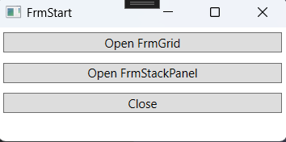
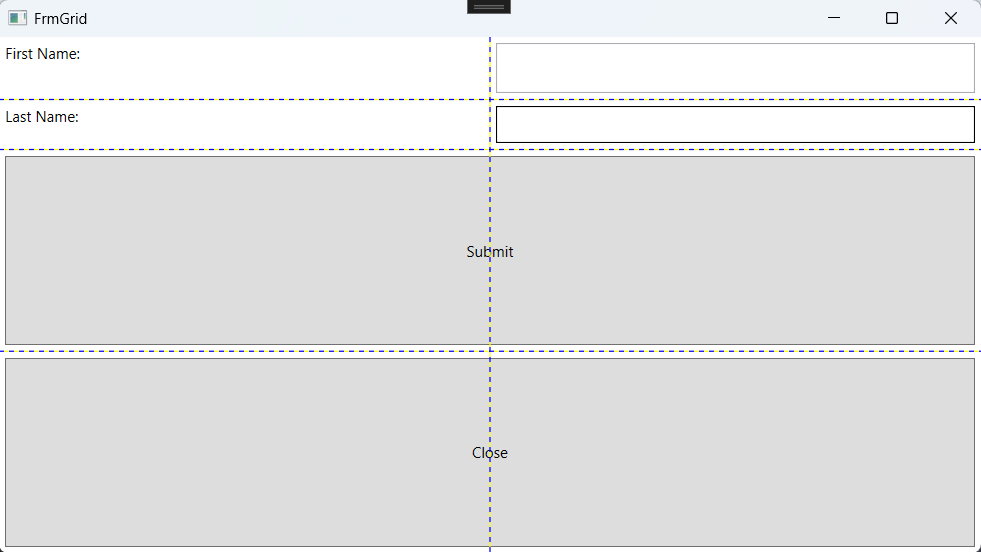
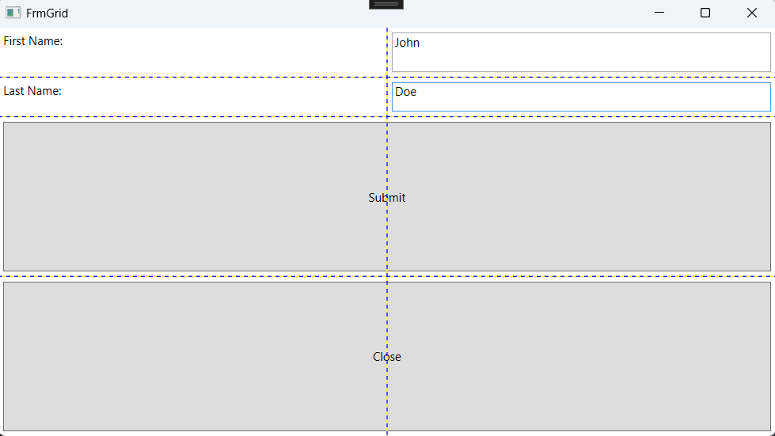
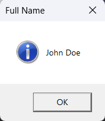
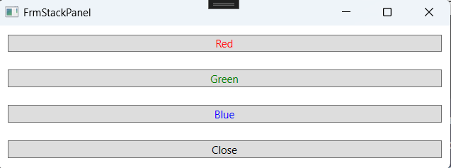
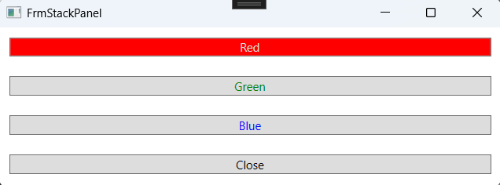
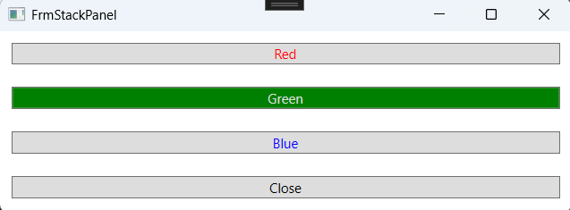
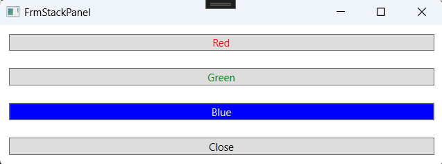

# WPF Start examples

## Project Structure

- **FrmStart.xaml**: The main window's XAML file.
- **FrmStart.xaml.cs**: Code-behind for the main window.
- **FrmGrid.xaml**: XAML file for the Grid layout window.
- **FrmGrid.xaml.cs**: Code-behind for the Grid layout window.
- **FrmStackPanel.xaml**: XAML file for the StackPanel layout window.
- **FrmStackPanel.xaml.cs**: Code-behind for the StackPanel layout window.
- **Command Binding**: Uses command binding for handling button clicks.

### FrmStart Window

The main window with buttons to open other windows and close the application.

### FrmGrid Window

Demonstrates the use of the Grid layout.

### FrmStackPanel Window

Demonstrates the use of the StackPanel layout.

