# WPF Start Exercises

## Setup
- Create a project named `WPF Start exercises`.
- Update the MainWindow to navigate to the exercises.

### Design

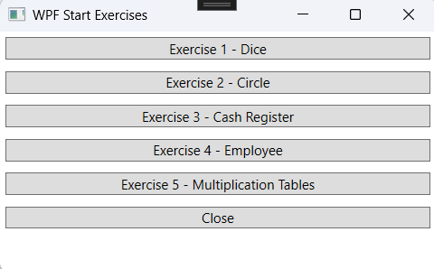

---

## Exercise 1 - Dice

### Objective
- Work with StackPanel, Label, and Button.
- Use properties such as `Name`, `Content`, `Background`, `Foreground`, etc.
- Work with the `Random` class.

### Design

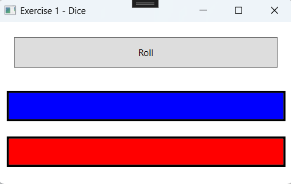

### Procedure
- When the "Roll" button is clicked, two random numbers are generated and displayed in their respective labels.

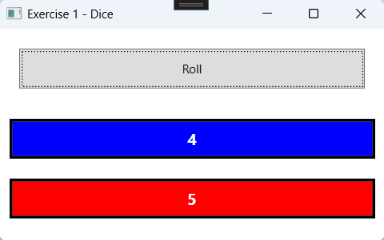

### Specifications
- Random numbers are generated using the `Random` class.

---

## Exercise 2 - Circle

### Objective
- Work with StackPanel, Label, Button, and TextBox.
- Use properties such as `Name`, `Content`, etc.
- Validate input data.

### Design

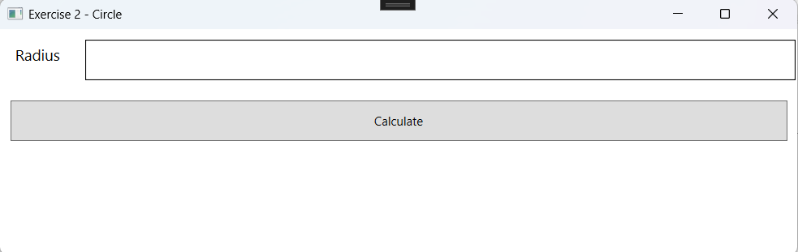

### Procedure
- Use only StackPanels for layout.
- When the "Calculate" button is clicked, the circumference and area are calculated and displayed.

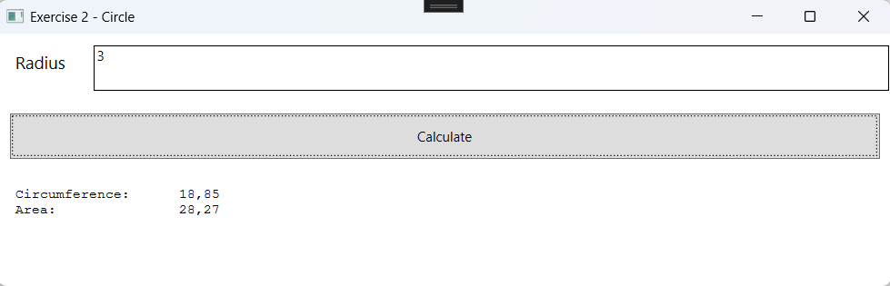

- If a non-numeric value is entered for the radius, an error message is displayed.
- [Reference](https://www.c-sharpcorner.com/article/uses-of-int-parse-convert-toint-and-int-tryparse/)

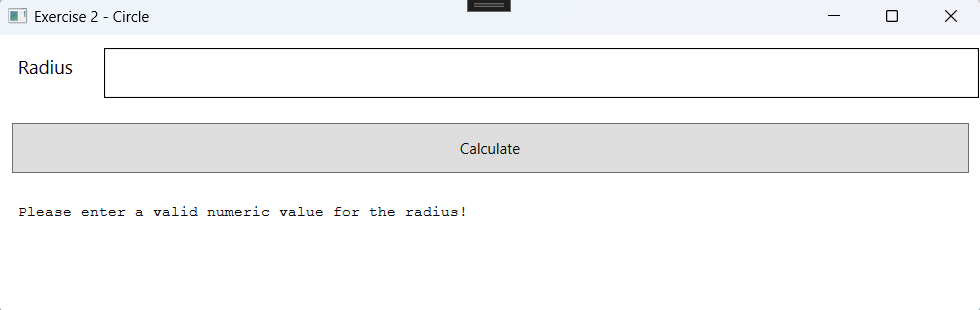

---

## Exercise 3 - Cash Register

### Objective
- Work with Grid, Label, Button, and TextBox.
- Use properties such as `Name`, `Content`, etc.
- Validate input data.
- Work with `HorizontalContentAlignment`.

### Design

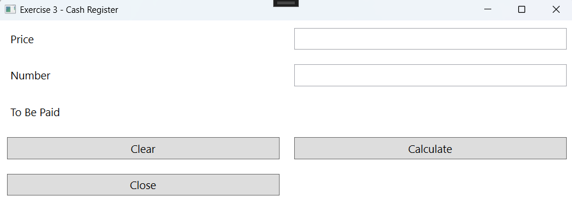

### Procedure
- Use a Grid for layout.
- When the "Clear" button is clicked, all fields are cleared.
- When the "Close" button is clicked, the window is closed.
- When the "Calculate" button is clicked, the total is calculated and displayed in a label.
- Ensure right alignment of text boxes and labels.
- [Reference](https://www.c-sharpcorner.com/UploadFile/mahesh/wpf-layout-content-alignments614/)

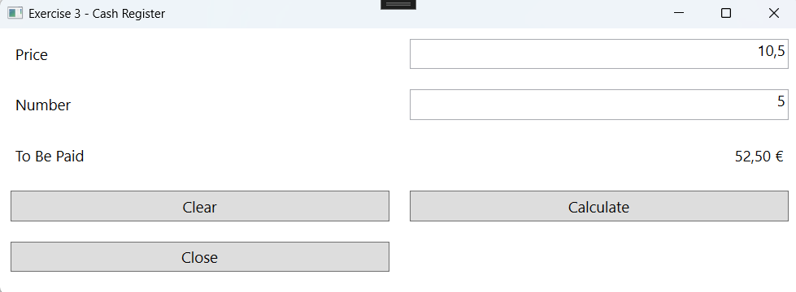

---

## Exercise 4 - Employee

### Objective
- Work with Grid, Label, Button, and TextBox.
- Use properties such as `Name`, `Content`, etc.
- Validate input data.
- Work with `PadLeft` and `PadRight`.

### Design

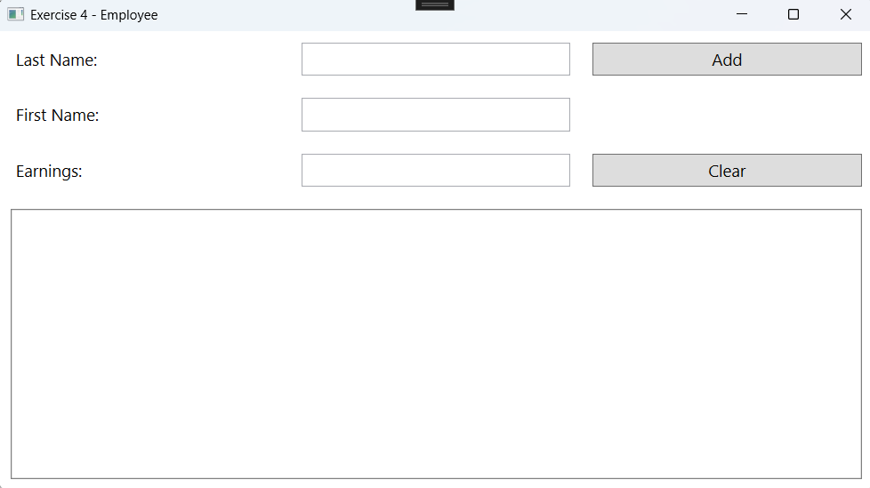

### Procedure
- Use a Grid for layout.
- When the "Add" button is clicked, the data is added to a multiline TextBox.

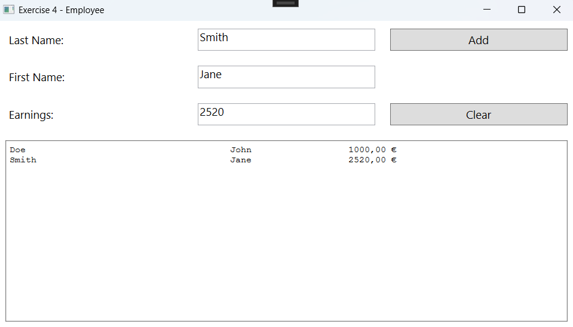

- Ensure validation for the input fields. All fields are mandatory, and the "Earnings" field must be numeric. Display an appropriate error message.

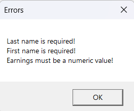

### Specifications
- Add a new line to a string using `Environment.NewLine`.
- Use `PadLeft` and `PadRight` to align text neatly. Use a monospaced font like Courier New.
- [Reference](https://www.c-sharpcorner.com/UploadFile/mahesh/padding-strings-in-C-Sharp/)

---

## Exercise 5 - Multiplication Tables

### Objective
- Work with Label, TextBox, and Button.
- Use properties such as `Name`, `Content`.
- Configure text alignment.
- Use a `while` loop or `for...next` structure.

### Design

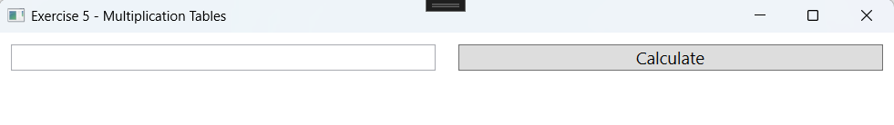

### Procedure
- Use a Grid for layout.
- When the "Calculate" button is clicked, the multiplication table for the specified number is displayed in the `lblResult` label.

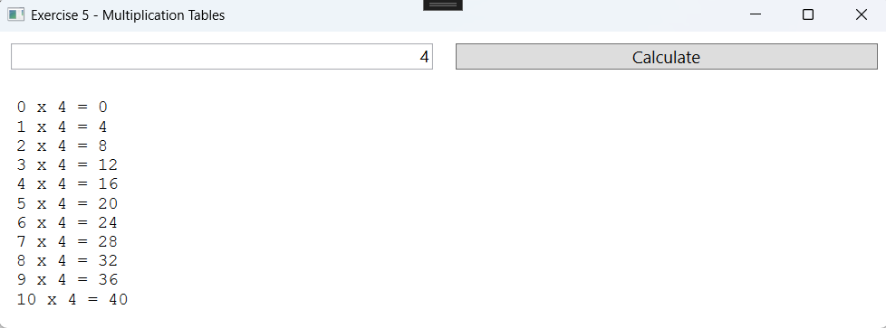

- If a non-numeric value is entered for the multiplication table, an error message is displayed.

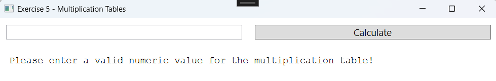