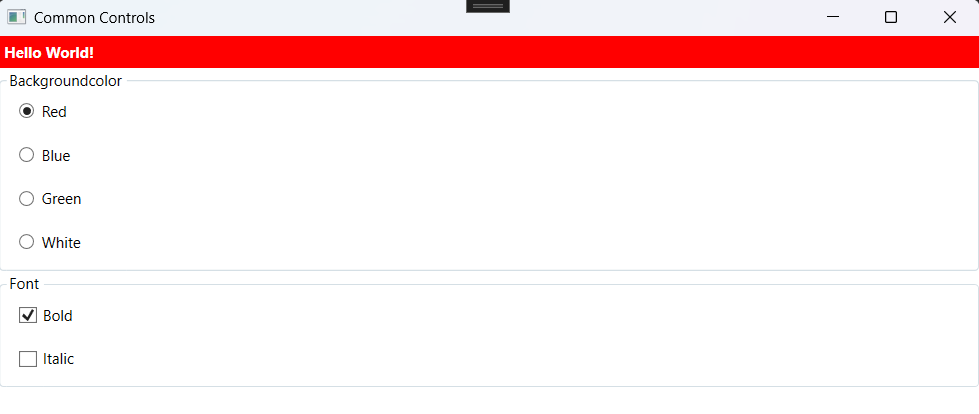
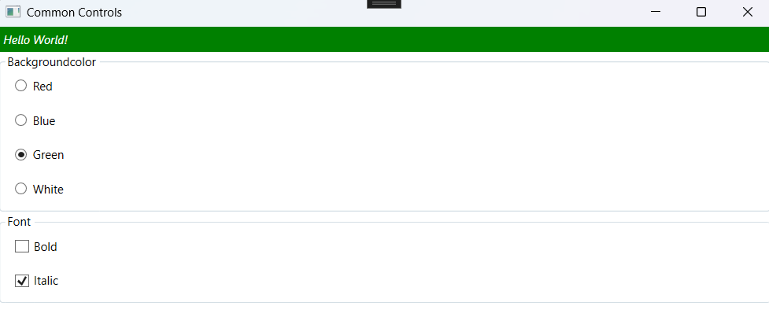

# WPF Common Controls examples

This project demonstrates the usage of common controls in a WPF application. It includes examples of how to use radio buttons, checkboxes, and labels to create a simple user interface.

- Change the background color of a label using radio buttons.
- Toggle bold and italic font styles using checkboxes.

