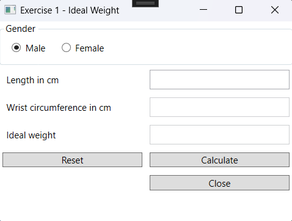

# WPF Common Controls Exercises

## Exercise 1 – Ideal Weight

### Objective
- Work with WrapPanel, Grid, Label, TextBox, RadioButton, and Button.
- Use properties such as `Name`, `Content`, `IsChecked`, etc.

### Design
The ideal weight for a man can be calculated based on his height. The ideal weight for a woman can be calculated based on her height and wrist circumference. The formula is different for men and women.



### Procedure
- When the user clicks the "Calculate" button, the ideal weight is calculated, and the result is displayed in the bottom text box.
- The ideal weight is rounded to one decimal place. The text box for "Ideal Weight" cannot be reached using the Tab key. The tab order for the remaining fields must be set correctly.
- The ideal weight is calculated using the following formulas:
  - For men: Subtract 100 from the height in cm. Reduce the resulting number by 10%. The result is the ideal weight.
  - For women: The formula is `M = (L + 4 x P – 100) / 2`, where `M` is the body weight in kg, `L` is the height in cm, and `P` is the wrist circumference in cm.


- If non-numeric values are entered, an error message is displayed.


### Specifications
- To set the tab order for controls, use `TabIndex`. `TabStop` ensures that the field is skipped when pressing Tab.
- [Reference](https://www.wpf-tutorial.com/control-concepts/tab-order/)

---

## Exercise 2 – VAT

### Objective
- Work with `int.TryParse` or `double.TryParse`.

### Design


### Procedure
- When the form loads, the 21% option is selected.
- The "Amount Including VAT" text box is not editable.
- The user selects a VAT percentage and enters an amount. When the "Calculate" button is clicked, the amount including VAT is calculated.


- If a non-numeric value is entered, an error message is displayed.


---

## Exercise 3 – Reading Files (Basic)

### Objective
- Work with integers.
- Work with `int.TryParse` or `double.TryParse`.
- Work with `Try...catch`.
- Work with string functions.
- Work with methods.

### Design


### Procedure
- The user can choose which records to display from the file: only valid records, only invalid records, or both.
- Depending on the selection, when the "Print" button is clicked, the file is read, and the necessary records are displayed in the labels. A check is first performed on the record to determine if it is valid or invalid.
- The data validation of a record is done using a method:
```csharp
  private bool dataValidation(string line, out string errorMessage, out string result) 
```
- The return value indicates whether the record is valid or not. If there is an error message, the record is invalid.
- The error message corresponds to the message(s) included in the file.
- `Result` corresponds to the line with a newline character.


### Specifications
- A file is read with the following data: `email`.
- These records are checked for:
	- The email address must contain an `@` and a `.`.

---

## Exercise 4 – Reading Files (Advanced)

### Objective
- Work with integers.
- Work with `int.TryParse` or `double.TryParse`.
- Work with `Try...catch`.
- Work with string functions.
- Work with methods.

### Design


### Procedure

- The user can choose which records to display from the file: only valid records, only invalid records, or both.
- Depending on the selection, when the "Afdrukken" (Print) button is clicked, the file is read, and the necessary records are displayed in the labels. A check is first performed on the record to determine if it is valid or invalid.
- The data validation of a record is done using a method:
```csharp
  private int dataValidation(string line, out string errorMessage, out string result) 
```
- The return value indicates whether the record is valid or not. For an invalid record, it is `-1`.
- The error message corresponds to the message(s) included in the file.
- `Result` corresponds to the formatted line displayed in the label.


- After reading all valid records, the average age is displayed.

### Specifications
- A file is read with the following data: `number;name;age;email`.
- These records are checked for:
	- The number must be numeric.
	- The name must not be numeric.
	- The gender must be `M` or `F`.
	- The email address must contain an `@` and a `.`.
	- The age must be numeric and greater than 0.