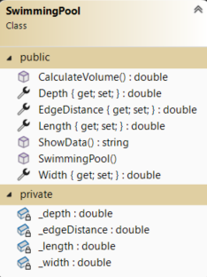
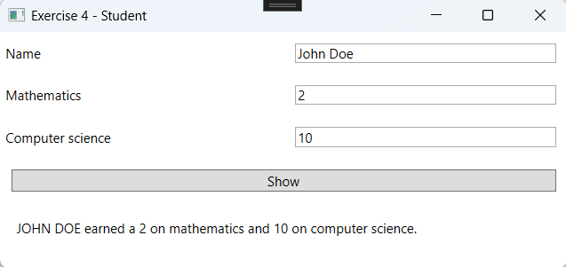

# Object Oriented Programming Part 1 Exercises

## Setup
- Create a project. The solution name must be:`OO_Exercises`, the project name: `OO_Exercises_WPF`.
- Update the MainWindow to navigate to the exercises.

### Design

---

# Exercise 1 - Counter

## Objective
- Work with Button.
- Work with Class-Library and Classes.

## Class Design
Create a class that simulates a counter. A class-library is used.

### Additional Information:
- The property is only retrievable from outside, meaning only the `get` part can be accessed.
- Method `Increment()`: Increments the counter by one.
- Method `Decrement()`: Decrements the counter by one.
- Method `Reset()`: Resets the counter to 0.
- Method `ShowData()`: Provides a textual representation of the object: Current value of the counter is `Value`.

Example: 

- Note that the `Value` property is set to `private`.

## Design

## Procedure
- When the "Show count value" button is clicked, the value of the counter is read and displayed via a MessageBox.

- When the "Increment count by one" button is clicked, the counter value is incremented by one. The value is not displayed. The other buttons work similarly. To retrieve the value again, you must click the "Show count value" button again.

---

# Exercise 2 - TV

## Objective
- Work with Button and Label.
- Work with Class-Library and Classes.
- Validations.

## Class Design
A television has a channel and a volume. The channel and volume can only be incremented or decremented by one using methods.

### Additional Information:
- Method `ChangeChannelUp()`: Increments the channel by one. The channel cannot exceed 30.
- Method `ChangeChannelDown()`: Decrements the channel by one. The channel cannot be less than 0.
- Method `IncreaseVolume()`: Increases the volume by one. The volume cannot exceed 10.
- Method `DecreaseVolume()`: Decreases the volume by one. The volume cannot be less than 0.
- Method `ShowData()`: Provides a textual representation of the object: Channel: `Channel` – Volume: `Volume`

Example: 

## Design

## Procedure
- When the form loads, the TV data is already displayed.
- When the buttons are clicked, the corresponding methods (`IncreaseVolume`, `DecreaseVolume`, `ChangeChannelUp`, `ChangeChannelDown`) are called. The text is updated each time.

---

# Exercise 3 - Swimming Pool

## Objective
- Work with Grid, TextBox, Label, and Button.
- Work with Class-Library and Classes.
- Validations.

## Class Design
A swimming pool has a length, width, and depth. It can be filled with water up to a specified number of centimeters from the top edge. The class should provide the maximum amount of water (in liters).

### Additional Information:
- Width, Depth, and Length cannot be less than 0. If an invalid value is entered, they are set to 0.
- The `EdgeDistance` must be less than the `Depth` and cannot be less than 0. If an invalid value is entered, it is set to 0.
- Method `CalulacteVolume`: The amount of water is calculated using the formula: 
``Amount = Width * Length * (Depth – EdgeDistance) * 1000``
- The return value of the `ToonGegevens` method is a textual representation of the object:
Depth = `Depth`
Width = `Width`
Length = `Length`
Edge distance = `EdgeDistance`
Liters Water = `CalulacteVolume()`

Example: 

- A class-library is used.

## Design

## Procedure
- When the "Calculate" button is clicked, a swimming pool object is created, the values are populated, and the result is displayed. Use the `ShowData` method!

- Ensure that when negative values are entered, the attributes are set to 0!

- The necessary validation is performed!

---

# Exercise 4 - Student

## Objective
- Design a class.

## Class Design
Design the `Student` class.
We need to track a student's name, grades in Informatics, and grades in Mathematics. We also need to retrieve a textual representation of all the student's data.

- Class Name:
- Attributes:
- Properties:
- Constructor:
- Methods:

Have this checked by the instructor first!
After approval by the instructor, this can be programmed.

### Additional Information:
- Grades cannot be less than 0 or greater than 20. If an invalid value is entered, the grade is set to 0.
- If the name is an empty string, it is set to `"..."`; otherwise, it is converted to uppercase.
- The textual representation of the object is as follows:
``... earned a ....... on mathematics and ....... on computer science.``

## Design

## Procedure
- When the "Show" button is clicked, a `Student` object is created, the values are populated, and the result is displayed. Use the appropriate method from the object to print the data!

- Example when the name is not filled in:

- Example when grades are not filled in:

---

# Exercise 5 – Rectangle

## Objective
- Design a class and its design.

## Class Design
Design the `Rectangle` class.
For a rectangle, we want to: Set the height. Retrieve the height. Set the width. Retrieve the width. Retrieve the area. Retrieve the textual representation of the object.

- Class Name:
- Attributes:
- Properties:
- Constructor:
- Methods: