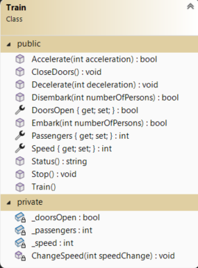

# Object Oriented Programming Part 2 Exercises

## Setup
- Create a project. The solution name must be:`OO_Exercises`, the project name: `OO_Exercises_WPF`.
- Update the MainWindow to navigate to the exercises.

### Design


---

## Exercise 1 - Square

### Objective
- Work with Classes.

### Class Design


### Additional Information:
- Property `Side` : The side cannot be less than 0 or greater than 25. If an invalid value less than 0 is entered, it is set to 0. If an invalid value greater than 25 is entered, it is set to 25.
- Method `Area` : The area is calculated as: `Side * Side`.
- Method `Perimeter` : The perimeter is calculated as: `4 * Side`.
- Method `Diagonal` : The length of the diagonal is calculated as: `squareroot(2* Side^2)`.
- Method `Draw` : Draws a square using a star matrix with the specified side.
  Example: Side = 3  -> 3x3 square
  Result: 
```       
***
***
***
```
### Design

Example: 

### Procedure
- When the "Initialize" button is clicked, a `Square` object is initialized (using a constructor with all parameters). If a non-numeric value is entered, an error message is displayed. The `Square` object is only created and the side is set behind this button!


- When the "Draw" button is clicked, the star matrix is displayed in the label.


- When the "Perimeter" button is clicked, the perimeter is displayed in a MessageBox.


- When the "Area" button is clicked, the area is displayed in a MessageBox.


- When the "Diagonal" button is clicked, the length of the diagonal is displayed in a MessageBox.


---

## Exercise 2 - BMI

### Objective
- Work with Classes.

### Class Design


### Additional Information:
- Method `ShowData` : Provides a textual representation of the object: ``Name weighs Weight kg and is Length m tall.``

Example: 

- Method `CalculateBMI()`: Calculates the BMI as: `Weight / (Length * Length)`.

### Design


### Procedure
- When the "Calculate" button is clicked, a `BMI` object is created (using a constructor with all parameters). The results are displayed in the labels.


- If a non-numeric value is entered, an error message is displayed. If the name is not filled in, an error message is displayed.

 

---

## Exercise 3 - Lamp

### Objective
- Work with Classes.

### Class Design


### Additional Information:
- Properties `Red`, `Green`, `Blue` : Values cannot be less than 0 or greater than 255. If an invalid value less than 0 is entered, it is set to 0. If an invalid value greater than 255 is entered, it is set to 255.
- Method `MoreRed` / `MoreGreen` / `MoreBlue`: Increases the corresponding property by 10.
- Method `LessRed` / `LessGreen` / `LessBlue`: Decreases the corresponding property by 10.
- Method `RandomColor`: Sets the `Red`, `Green`, and `Blue` properties to random values.
- Method `ShowRgbValues`: Provides a textual representation of the object: ``Red = Red Green = Green Blue = Blue``
- Example: 

- Method `GetLampColor`: Returns a `SolidColorBrush` object based on the RGB values.

```csharp 
public SolidColorBrush GetLampColor() 
{ 
    return new SolidColorBrush(Color.FromRgb(Red, Green, Blue)); 
} 
```

### Design


### Procedure

- When the form loads, a lamp is created with RGB values of 125. Use the constructor with three parameters. The correct RGB values are displayed in the label. Use the appropriate method.


- When the "Random Color" button is clicked, the RandomKleur method is called. Display the correct color and RGB values in the label.


- When the "More Red" / "More Green" / "More Blue" / "Less Rood" / "Less Green" / "Less Blue" buttons are clicked, the corresponding method of the lamp is called. Display the correct color and RGB values in the label.

---

## Exercise 4 - Train

### Objective

- Work with Classes.

### Class Design



### Additional Information:

- Default constructor: Doors are open, and the number of passengers is set to 0.
- Property `Passengers` : The number of passengers cannot be less than 0. If an invalid value is entered, it is set to 0.
- Property `Speed` : The speed cannot be greater than 120 or less than 0. If an invalid value less than 0 is entered, it is set to 0. If an invalid value greater than 120 is entered, it is set to 120.
- Method `Disembark` : Passengers can only disembark if the doors are open. Returns `true` if passengers disembarked, otherwise `false`.
- Method `Embark` : Passengers can only board if the doors are open. Returns `true` if passengers boarded, otherwise `false`.
- Method `CloseDoors` : Closes the doors.
- Method `ChangeSpeed` : All speed changes (accelerate, decelerate, brake) are handled by this internal function. It adjusts the speed (using the `Speed` property).
- Method `Stop` : The speed is set to 0. This speed change is handled by the `ChangeSpeed` method. The doors open.
- Method `Accelerate` : The speed is increased by the acceleration, but only if the doors are closed. Returns `true` if the train accelerated, otherwise `false`.
- Method `Decelerate` : The speed is decreased by the deceleration. This speed change is handled by the `ChangeSpeed` method.
- Method `Status` : Provides a textual representation of all properties:
```
Speed: Speed
Passengers: Passengers
Doors: doorsStatus
```


### Design


### Procedure

- When the "Embark" / "Disembark" buttons are clicked, the corresponding method of the train is called.


- When the "Accelerate" / "Decelerate" buttons are clicked, the corresponding method of the train is called.


- When the "Close Doors" button is clicked, the `CloseDoors()` method of the train is called.


No one can board or disembark now.


- When the "Stop" button is clicked, the `Stop` method of the train is called.


- The status is updated after each action!
- Ensure a proper message is displayed if a non-numeric value is entered!

---

## Exercise 5 - Tamagotchi

### Objective

- Work with Classes.

### Class Design

We are creating a Tamagotchi, you know, that electronic pet.
This pet needs to be fed and loved. In the first version, the class diagram looks like this:


### Additional Information:

- Property `WellBeing` : This value can range from -10 (very bad) to +10 (excellent). If the value is too high, it is set to 10. If the value is too low, it is set to -10.
- Property `Hunger` : This value can range from -5 (almost dead) to +20 (more than satisfied). If the value is too high, it is set to 20. If the value is too low, it is set to -5.
- Method `Feed` : You can feed the Tamagotchi. The `Feed` method has a parameter indicating how many units are given. However, the Tamagotchi can only absorb 3 units at a time, even if more are offered. The time of feeding is recorded in LastMeal.

``` 
LastMeal = DateTime.Now; 
```

- Method `Pet` : You can pet the Tamagotchi if it is still alive. Each time you do this, the `WellBeing` increases by 1.
- Method `Punish` : You can also punish the Tamagotchi if it is still alive. You specify how much you punish. The `WellBeing` decreases by the same amount.
- Method `Feeling` : Provides a textual representation of how the Tamagotchi feels. Before responding, the Tamagotchi calculates how it feels. Each time you ask, its `WellBeing` decreases by 1 (it misses your affection). However, its `WellBeing` will not go below 0 this way. If it hasn't eaten for 30 seconds, its `Hunger` decreases by 1.

```csharp
now = DateTime.Now;
time = now.Subtract(LastMeal);
seconds = time.Hours * 3600 + time.Minutes * 60 + time.Seconds;
hungerUnits = seconds / 30;
```
The method to ask its feeling will describe both its `WellBeing` and `Hunger`:
`Feeling = WellBeing - hunger = Hunger `

### Design


### Procedure

- When the "Create" button is clicked, a Tamagotchi is created with the entered name. A MessageBox appears confirming the Tamagotchi has been created.

 

- When the "Pet Tamagotchi" button is clicked, the Tamagotchi is petted.
- When the "Feed" button is clicked, the Tamagotchi is fed.
- When the "Punish" button is clicked, the Tamagotchi is punished.
- When the "?" button is clicked, the Tamagotchi's feeling is asked.


- Test whether your program crashes when non-numeric values are entered for feeding or punishing.
- Test whether your program crashes when you click feed, punish, or pet before creating a Tamagotchi.