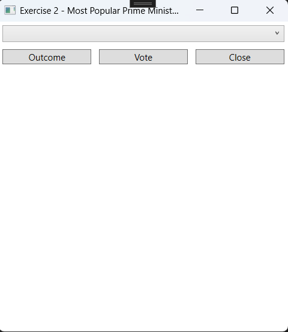

# Collections Exercises

## Setup
- Create a project. The solution name must be:`CollectionsExercises`, the project name: `CollectionsExercises_WPF`.
- Update the MainWindow to navigate to the exercises.

### Design

---

## Exercise 1 - Animals

### Objective
- Working with Lists
- Working with Listboxes

### Design

### Procedure

- When the "Read and Print" button is pressed, the file `animals.txt` is read into a list. This list is then linked to the listbox.

- When the "Add" button is pressed, the new animal is added to the list. Display an appropriate message if the text field is empty. Duplicate animals are not allowed!

  

 

- When the "Clear" button is pressed, the list is emptied. The listbox is updated accordingly!

- When the "Delete" button is pressed, the selected item is removed from the list. The listbox is updated accordingly!

 

- When the "Sort" button is pressed, the list is sorted. The listbox is updated accordingly!

---

## Exercise 2 - Most Popular Prime Minister Since 1973

### Objective
- Working with ComboBox
- Working with Global Variables

### Windows Application
A survey is conducted to determine the most popular prime minister since 1973.

### Procedure

- When the form is loaded, the file `ministers.txt` is read into a list. This list is linked to the combobox.

- For each minister, keep track of the number of votes they have received. Create a list of integers with as many elements as there are ministers.

- The number of votes for a minister is incremented by 1 after selecting a minister from the dropdown and pressing the "Vote" button. Display an error message if no minister is selected.

- The results with the number of votes are displayed after pressing the "Results" button.

---

## Exercise 3 - Students with Results

### Objective
- Working with Lists
- Working with Listboxes

### Design

### Procedure

- When the "Read Students and Print" button is pressed, the file `students.txt` is read into a list. This list is displayed in the listbox.

- When the "Read Grades and Print" button is pressed, the file `grades.txt` is read into a list. This list is also displayed in the listbox.

- When the "Determine Results and Print" button is pressed, a combination of the student, their grade, and the achieved result is created. The number of passing and failing students is also tracked. This list is displayed in the listbox.

- When the "Clear" button is pressed, all lists are emptied.

- When the "Close" button is pressed, the application is closed.