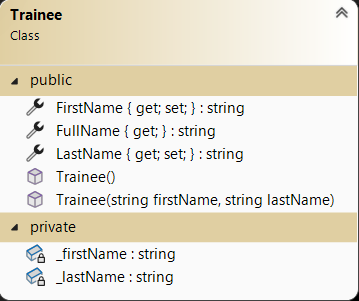

# Collections and OO Exercises

## Setup
- Create a project. The solution name must be:`CollectionsAndOOExercises`, the project name: `CollectionsAndOOExercises_WPF`.
- Update the MainWindow to navigate to the exercises.

### Design

---

## Exercise 1 - TV Channel

### Objective
- Work with List and ComboBox.
- Work with Class-Library and Classes.

### Class Design
On a TV remote control, there are numbers corresponding to TV channels:
1. BBC1
2. BBC2
3. ITV
4. Channel 4
5. Channel 5

Create a class that represents a `TelevisionChannel` . A class-library is used.

#### Additional Information:
- Method `ToString()`: The return value is a textual representation of the object:

*Number - Description*

Example: 1 - BBC1

## Design

## Procedure
- When the form loads, a list is populated with `TelevisionChannel` objects. This list is linked to the ComboBox.

- When you select a channel in the ComboBox, the channel number appears in the label.

---

## Exercise 2 - Trainee

### Objective
- Work with Button and Label.
- Work with Class-Library and Classes.
- Validations.

### Class Design
We create the following class `Trainee`.

#### Additional Information:
- Property `Name` : Represents the full name of the trainee.

### Design

### Procedure
- When the form loads, a list is populated with `Trainee` objects. This list is linked to a ListBox.

- When a trainee is selected from the ListBox, the text boxes are populated.

- After selecting, you can modify the data and apply the changes by clicking "Update". After modifying, the text fields are cleared.

  

- When the "Delete" button is clicked, the selected item is removed from the list.

The trainee is only deleted after confirmation.

  

- You can also add a trainee to the list. First, a validation is performed on the text fields! Ensure the ListBox stays up-to-date!

  
  
  

---

## Exercise 3 - Shopping Cart

### Objective
- Work with TextBox, Label, and Button.
- Work with Class-Library, Classes, and List.
- Validations.

### Class Design
We create a class `ShoppingCartItem` with the following UML schema.

#### Additional Information:
- Property `TotalPrice` is calculated as: `quantity * price`.
- Method `FormattedTotalPrice`: Returns the total price as a string with 2 decimal places.
- Method `ToString`: Provides a textual representation:

*Quantity * Name: TotalPrice*

Example: 

- A class-library is used.

### Design

### Procedure
- When the "Add" button is clicked, a `ShoppingCartItem` is created and added to the list after the necessary checks! Ensure the 3 text boxes are filled and that the price and quantity are numeric.

- When the "Show Shopping Cart" button is clicked, the contents are summarized, and the total amount of the shopping cart is displayed. Use the correct method to display the `ShoppingCartItem`!

