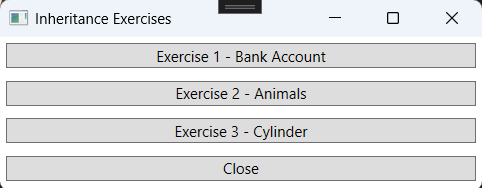
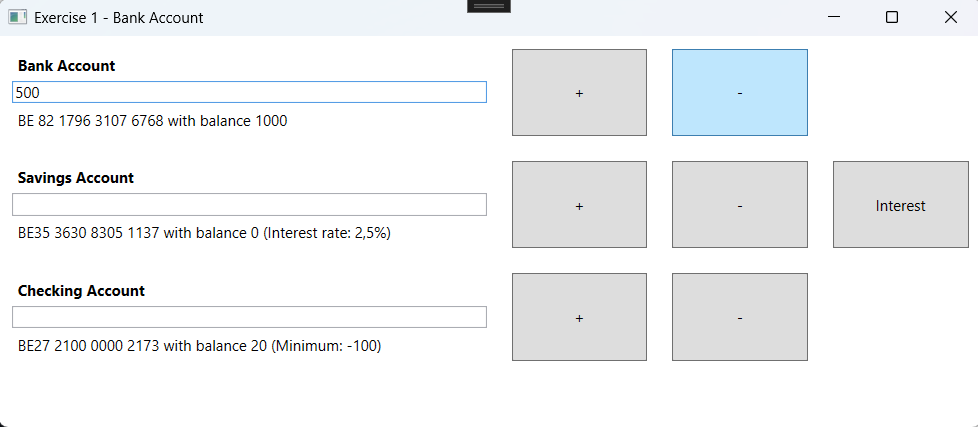

# Inheritance Part 1 Exercises

## Setup
- Create a project. The solution name must be:`InheritancePart1Exercises`, the project name: `InheritancePart1Exercises_WPF`.
- Update the MainWindow to navigate to the exercises.

### Design



---

# Exercise 1 - Bank Account

## Objective
- Work with Class-Library and Classes.
- Work with inheritance.

## Class Design


### Additional Information for `BankAccount` Class:
- Property `Balance`: The balance cannot go below the minimum. If an invalid value is entered, the balance is set to the minimum.
- Property `CountryCode`: Returns the first 2 characters of the IBAN number.
- Method `Deposit(double)`: Adds the amount to the balance.
- Method `Withdraw(double)`: Subtracts the amount from the balance.
- Method `ShowData()`: Returns a textual representation of the object:
IBAN: `IBAN` with balance: `Balance`

Example: 

### Additional Information for `SavingsAccount` Class:
- Method `ShowData()`: Returns a textual representation of the object:
IBAN: `IBAN` with balance: `Balance` (Interest rate: `InterestRate`)

Example: 

### Additional Information for `CheckingAccount` Class:
- Constructor: The minimum balance is set to -100.

## Design


## Procedure
- When the form loads, a `BankAccount`, `SavingsAccount`, and `CheckingAccount` are created with a specific balance and number.


- When the "+" or "-" button is clicked, money is deposited or withdrawn from the corresponding account.
- Ensure correct handling when entering negative values!




- Validate for non-numeric values!

---

# Exercise 2 - Animals

## Objective
- Work with Class-Library and Classes.
- Work with inheritance.

## Class Design


### Additional Information for `Animal` Class:
- Property `Data`: Returns the value: <<My name is `Name` and I am `Class`.>> The class name is retrieved using `this.GetType().Name`.
- Method `Eat()`: Returns an empty string.
- Method `Talk(string)`: Returns an empty string.
- Method `Caress()`: Returns an empty string.
- Constructor: The `Animal` class itself is not instantiated (you cannot do `new Animal()`). However, it has a protected constructor that sets the name. Each class can only have one constructor!

### Additional Information for `Human` Class:
- Property `Data`: Returns the value: <<My name is `Name` and I am `Class`. Hahahaha!>> Use the base method!
- Method `Eat()`: Returns "Yummy!".
- Method `Talk(string sentence)`: Depending on the input, a specific response is given. Define 10 sentences with responses.
Example: "Good morning" -> "A good morning to you too!".
- Method `Caress()`: Returns "Get yours hands off me!".

### Additional Information for `Parrot` Class:
- Property `Data`: Returns the value: <<My name is `Name` and I am `Class`. Krr Krr!>> Use the base method!
- Method `Talk(string sentence)`: Returns the input sentence, except for a 1 in 5 chance, where it returns "Koko wants a cracker". The chance is random.
- Method `Caress()`: Returns "Koko".

### Additional Information for `Cat` Class:
- Property `Data`: Returns the value: <<My name is `Name` and I am `Class`. Meow, Meow!>> Use the base method!
- Method `Talk(string sentence)`: The cat returns a "meow" every 3rd time.
- Method `Caress()`: Returns "rrrrrrrrrrrr".

## Design


## Procedure
- When the form loads, a list of questions is populated and linked to the ListBox.
- An animal object must be created before the buttons can do anything. If no animal object is created, an error message is displayed.


---

# Exercise 3 - Cylinder

## Objective
- Work with Class-Library and Classes.
- Work with inheritance.

## Class Design


### Additional Information for `Point` Class:
- Property `Description`: Returns the value: <<`Class`: coordinates: (`x`, `y`)>>. The class name is retrieved using `this.GetType().Name`.
- Method `ShowData()`: Returns the description.

### Additional Information for `Circle` Class:
- Property `Description`: Returns the value: <<`Class`: coordinates: (`x`, `y`), radius `r`>>. The class name is retrieved using `this.GetType().Name`.
- Method `Circumference()`: Returns the circumference of the circle: Formula: 2 * π * `r`
- Method `Area()`: Returns the area of the circle: Formula: π * `r`^2
- Method `ShowData()`: Returns a textual representation of the object:

```
`Class`: coordinates: (`x`,`y`), radius `r`
Circumference: `circumference`
Area: `area`
```

The method uses the `Description` property. The area and circumference are rounded to 2 decimal places!

### Additional Information for `Cylinder` Class:
- Property `Description`: Returns the value: <<`Class`: coordinates: (`x`, `y`), radius = `r`, hight = `h`>> The class name is retrieved using `this.GetType().Name`.
- Method `Volume()`: Calculates the volume of the cylinder: Formula: π * `r`^2 * `h`
Use the area of the circle from the `Circle` class.
- Method `Area()`: Calculates the surface area of the cylinder: Formula: 2 * π * `r`² + 2 * π * `r` * `h`
Use the area and circumference from the `Circle` class.
- Method `ShowData()`: Returns a textual representation of the object:

```
`Class`: coordinates: (`x`,`y`), radius `r`, hight `h`
Area: `area`
Volume: `volume`
```
The method uses the `Description` property. The area and volume are rounded to 2 decimal places!

## Design


## Procedure
- When the "Test Point" button is clicked, a `Point` object is created.


- When the "Test Circle" button is clicked, a `Circle` object is created.


- When the "Test Cylinder" button is clicked, a `Cylinder` object is created.


- Validate for non-numeric values!

