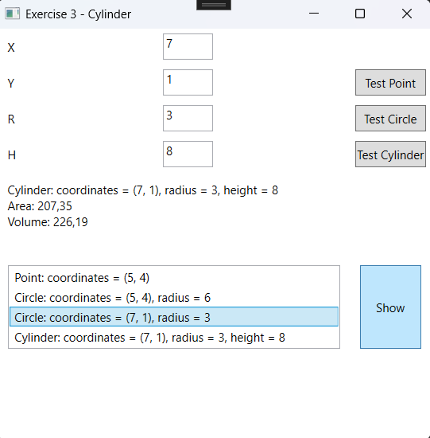

# Inheritance Part 2 Exercises

## Setup
- Create a project. The solution name must be:`InheritancePart2Exercises`, the project name: `InheritancePart2Exercises_WPF`.
- Update the MainWindow to navigate to the exercises.

### Design


---

# Exercise 1 - Bank Account

## Objective
- Work with Class-Library and Classes.
- Work with inheritance.

## Class Design

Start from the exercise `Bank Account` from Inheritance Part 1.


## Design


## Procedure
- When the form loads, the file `bankAccounts.txt` is read. This populates a list of accounts. The ComboBox is linked to the list. Use a DAL (Data Access Layer).

- 

- When the "+" or "-" button is clicked, money is deposited or withdrawn from the corresponding account.- Ensure correct handling when entering negative values!


- Validate for non-numeric values!


- When the "Interest" button is clicked, interest is added to the savings account. This only works for savings accounts!

 

 

---

# Exercise 2 - Animals

## Objective
- Work with Class-Library and Classes.
- Work with inheritance.

## Class Design

Start from the exercise `Animals` from Inheritance Part 1.


## Design


## Procedure
- When the "Create" button is clicked, a `Cat`, `Parrot`, or `Human` object is created. This object is added to a list. The list is linked to the ListBox.
- Use polymorphism!
- When the buttons are clicked, it is first checked whether an item in the list is selected. The corresponding method of the selected item is executed.
- Ensure the program does not crash if nothing is selected in the ListBox!
- 
 

---

# Exercise 3 - Cylinder

## Objective
- Work with Class-Library and Classes.
- Work with inheritance.

## Class Design

Start from the exercise `Animals` from Inheritance Part 1.


### Additional Information for `Point` Class:
- Property `Description`: Returns the value: <<`Class`: coordinates: (`x`, `y`)>>. The class name is retrieved using `this.GetType().Name`.
- Method `ShowData()`: Returns the description.

### Additional Information for `Circle` Class:
- Property `Description`: Returns the value: <<`Class`: coordinates: (`x`, `y`), radius `r`>>. The class name is retrieved using `this.GetType().Name`.
- Method `Circumference()`: Returns the circumference of the circle: Formula: 2 * π * `r`
- Method `Area()`: Returns the area of the circle: Formula: π * `r`^2
- Method `ShowData()`: Returns a textual representation of the object:

```
`Class`: coordinates: (`x`,`y`), radius `r`
Circumference: `circumference`
Area: `area`
```

The method uses the `Description` property. The area and circumference are rounded to 2 decimal places!

### Additional Information for `Cylinder` Class:
- Property `Description`: Returns the value: <<`Class`: coordinates: (`x`, `y`), radius = `r`, hight = `h`>> The class name is retrieved using `this.GetType().Name`.
- Method `Volume()`: Calculates the volume of the cylinder: Formula: π * `r`^2 * `h`
Use the area of the circle from the `Circle` class.
- Method `Area()`: Calculates the surface area of the cylinder: Formula: 2 * π * `r`² + 2 * π * `r` * `h`
Use the area and circumference from the `Circle` class.
- Method `ShowData()`: Returns a textual representation of the object:

```
`Class`: coordinates: (`x`,`y`), radius `r`, hight `h`
Area: `area`
Volume: `volume`
```
The method uses the `Description` property. The area and volume are rounded to 2 decimal places!

## Design


## Procedure
- Create a list of points. When a point, circle, or cylinder is created, it is added to the list. The list is linked to the ListBox. Use the following method to add to the ListBox:

```csharp
private void AddObject(Point point)
```

This method will add the point, circle, or cylinder to the list and refresh the ListBox.

- When the "Show" button is clicked, the `ShowData` method of the selected item in the ListBox is displayed in a MessageBox.

 
