# Inheritance Part 3 Exercises

## Setup
- Create a project. The solution name must be:`InheritancePart3Exercises`, the project name: `InheritancePart3Exercises_WPF`.
- Update the MainWindow to navigate to the exercises.

### Design

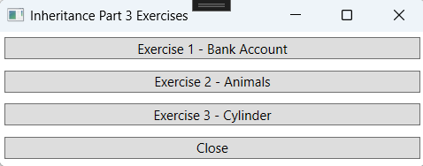

---

# Exercise 1 - Bank Account

## Objective
- Work with Class-Library and Classes.
- Work with inheritance.

## Class Design

Start from the exercise `Bank Account` from Inheritance Part 2.

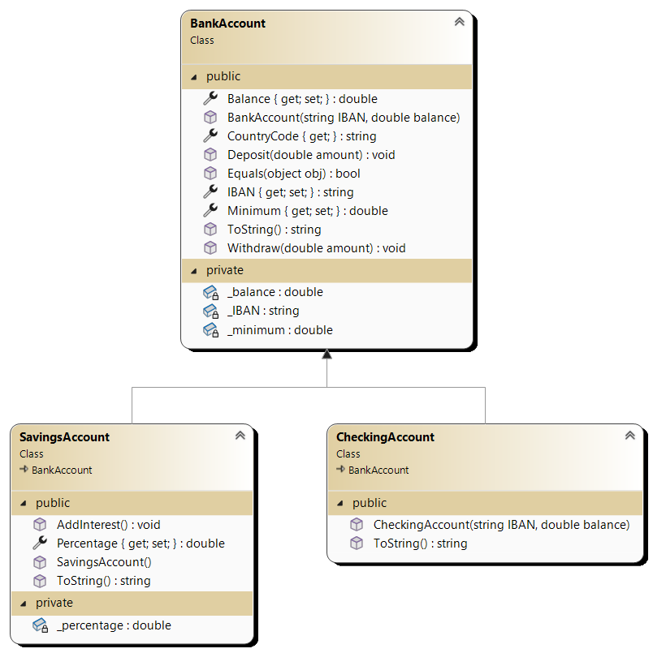

### Adjustments:
- Rename the `ShowData` method in the `BankAccount` and `SavingsAccount` classes to `ToString()`.
- Add a `ToString()` method to the `CheckingAccount` class. The return value is a textual representation of the object:
IBAN: `IBAN` with balance: `Balance` (Minimum: `Minimum`)
- Add the `Equals` method to the `BankAccount` class: Two accounts are the same if their IBAN numbers are the same, regardless of whether they are `BankAccount`, `SavingsAccount`, or `CheckingAccount`.

## Design

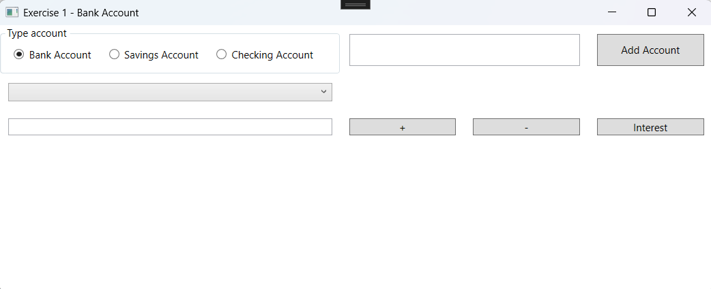

## Procedure
- Ensure that the `DisplayMemberPath` of the ComboBox is no longer set. This way, the `ToString()` method is implicitly used.

- When the form loads, the file `bankAccounts.txt` is read. This populates a list of accounts. The ComboBox is linked to the list. Use a DAL (Data Access Layer). (Refer to Inheritance 2 exercise.)

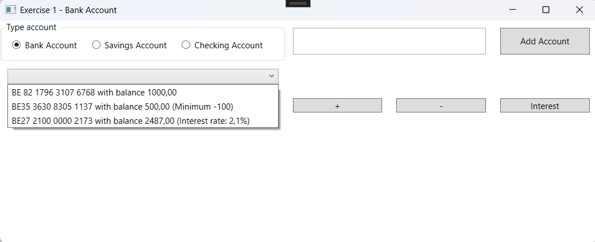

- Verify that the `ToString()` method is successfully used.

- When the "Add Account" button is clicked, an account of the desired type is created with the entered IBAN number. The created account can only be added to the list if it does not already exist in the list. If the IBAN number is already added or not filled in, an error message is displayed.

Example of a new account number:

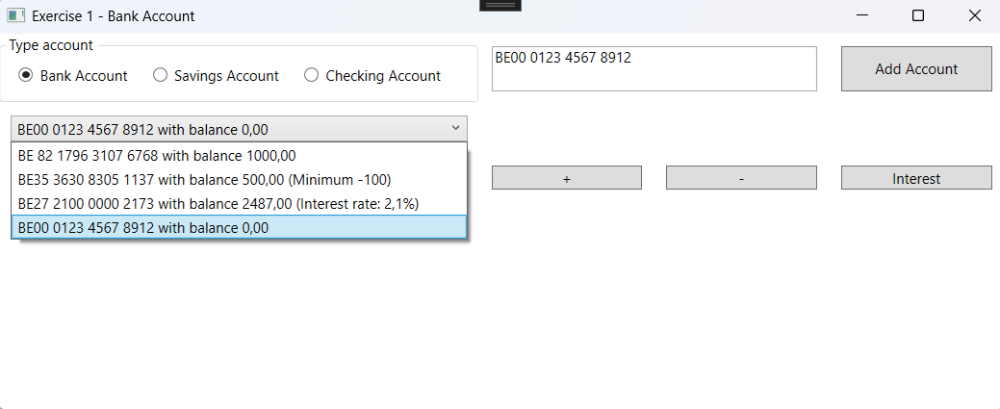

Example of an existing account number: The account object with the IBAN number cannot be added because a savings account with this IBAN number already exists.

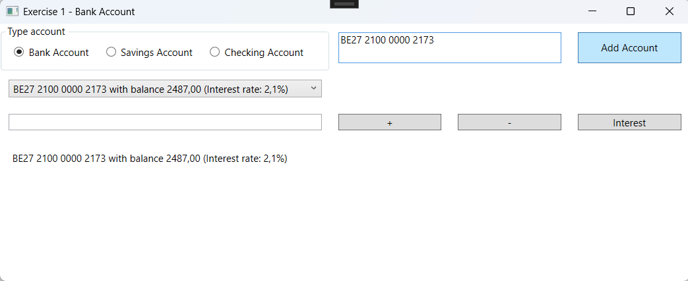 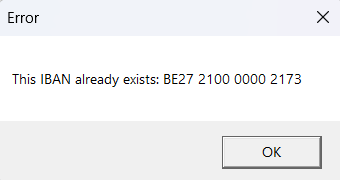

Example of an empty IBAN number:

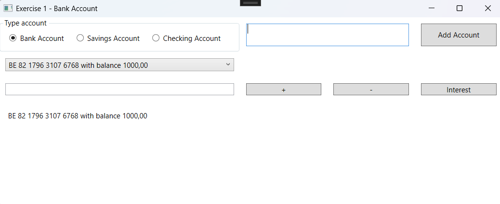 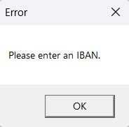

---

# Exercise 2 - Animals

## Objective
- Work with Class-Library and Classes.
- Work with inheritance.

## Class Design

Start from the exercise `Animals` from Inheritance Part 2.

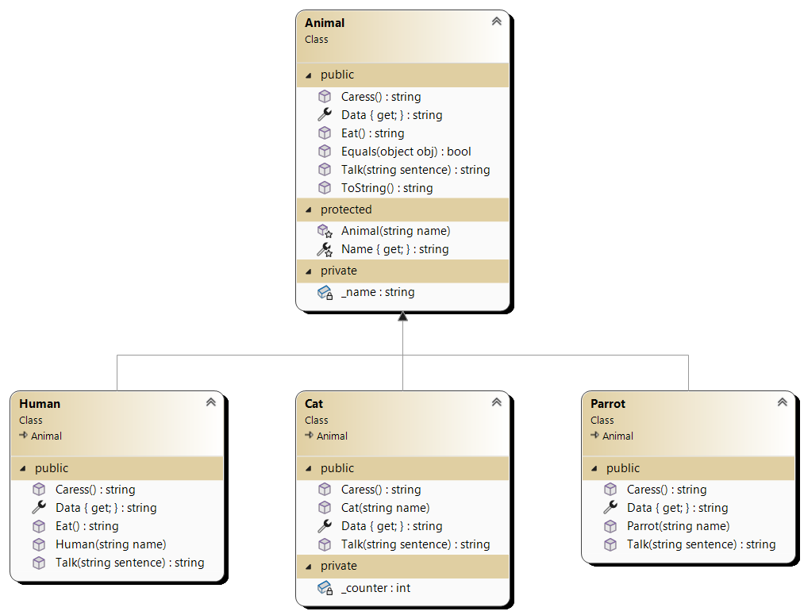

### Adjustments:
- Add a `ToString()` method. This method calls the `Data` property.
- Add the `Equals` method to the `Animal` class: Two objects are the same if their name and type are the same!

## Design

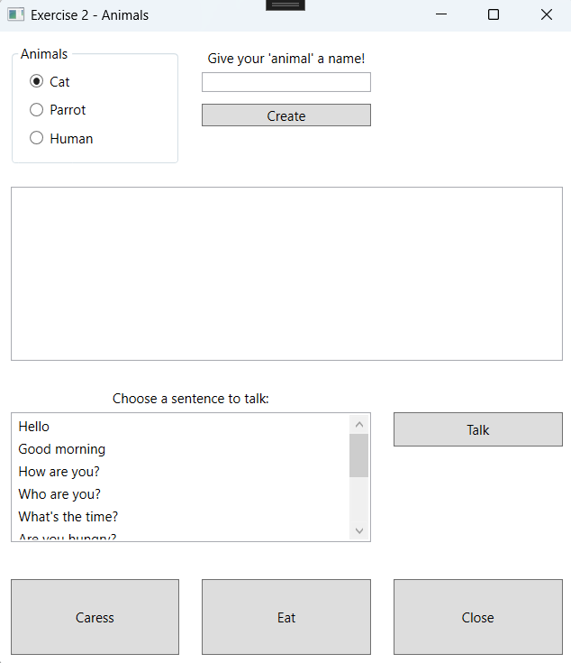

## Procedure
- Test the `ToString()` method by commenting out the `DisplayMemberPath`!
- Test the `Equals` method by adding two identical objects to the list.
- A parrot, cat, or human with the same name is allowed.

- 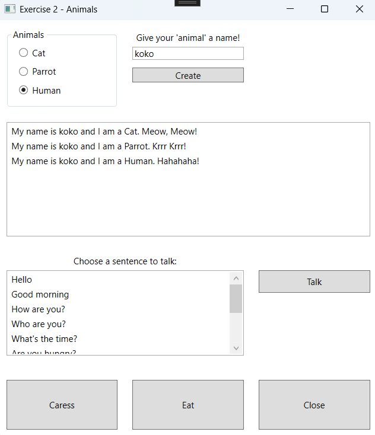

---

# Exercise 3 - Cylinder

## Objective
- Work with Class-Library and Classes.
- Work with inheritance.

## Class Design

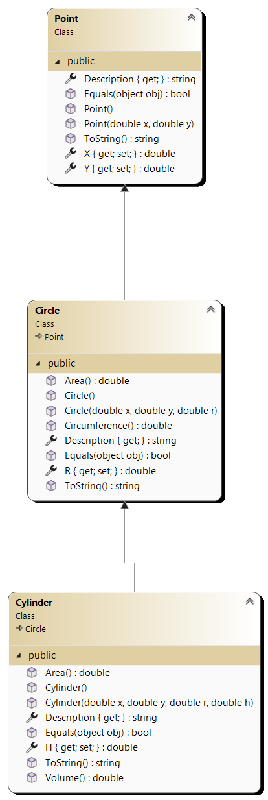

### Adjustments:
- Rename the `ShowData` method in the `Point`, `Circle`, and `Cylinder` classes to `ToString()`.
- Add the `Equals` method to the `Point` class: Two points are the same if their `x` and `y` values are the same and their types are the same.
- Add the `Equals` method to the `Circle` class: Two circles are the same if their `x`, `y`, and `r` values are the same and their types are the same (calls the `Equals` method of the `Point` class).
- Add the `Equals` method to the `Cylinder` class: Two cylinders are the same if their `x`, `y`, `r`, and `h` values are the same and their types are the same (calls the `Equals` method of the `Circle` class).

## Design

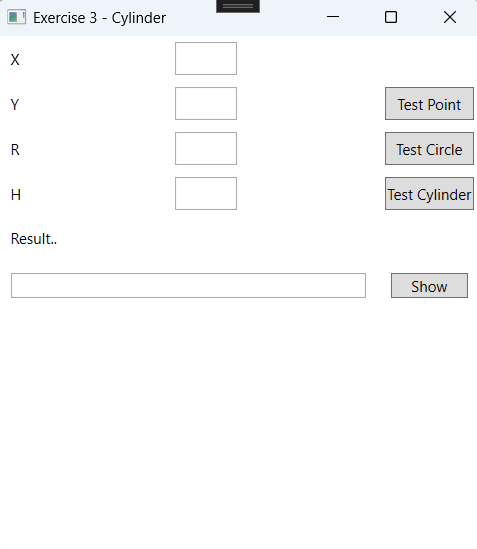

## Procedure
- Test the `ToString()` method by not setting the `DisplayMember` of the ListBox. You should still see the correct description.

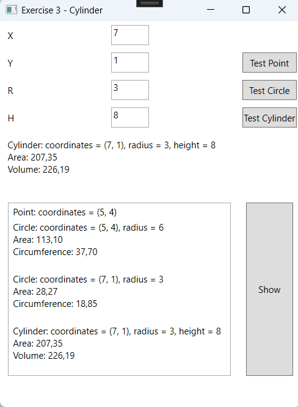

- Test the `Equals` method by adding two identical points, circles, or cylinders to the list of cylinders. The object can only be added if the list does not already contain it!

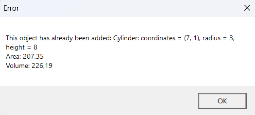

- Also test whether you can add a `Point` and a `Circle` with the same `x` and `y` values. This should work!