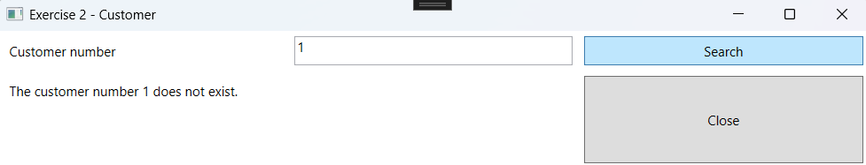

# Exception Handling Exercises

## Setup
- Create a project. The solution name must be:`ExceptionHandlingExercises`, the project name: `ExceptionHandlingExercises_WPF`.
- Update the MainWindow to navigate to the exercises.

### Design


# Exercise 1 - Bank Account

## Objective
- Work with Class-Library and Classes.
- Work with inheritance.
- Work with Exceptions.

## Class Design
Start from the `Bank Account` exercise in Inheritance Part 3.


### Adjustments:
- Create a `CustomException` class that inherits from `Exception`.
- Throw a `CustomException` in the `Balance` property if the balance is less than the minimum.

## Design


## Procedure
- The following file must be read when the form loads:

```
bank account;BE 00 0000 1111 2222;-1000
bank account;BE 82 1796 3107 6768;1000
checking account;BE35 3630 8305 1137;500
savings account;BE27 2100 0000 2173;2487;2,1
```


A list of accounts is populated. Only valid records are added. The ComboBox is linked to the list. Use a DAL (Data Access Layer). Handle the necessary errors!


- Handle the necessary errors when withdrawing money.

Example of withdrawing from a `Bank Account`:

 

Example of withdrawing from a `Checking Account`:

 

---

# Exercise 2 - Customer

## Objective
- Work with Class-Library and Classes.
- Work with inheritance.

## Class Design
Create the following `Customer` class:


### Additional Information:
- Two customers are the same if their `customer number` is the same.

Create the following `CustomerNotFoundException` class. This class inherits from `Exception`.

### Additional Information:
- The message provided by the exception is: `The customer number 'CustomerNumber' does not exist.`

## Design


## Procedure
- When entering a number and clicking "Search", the program checks if this customer exists in a list. The result is displayed in a label. Any errors are handled!

  - Create a method `ReadFile` that populates a list of `Customer` objects based on a file. Errors are handled and logged using the `LogError` method.


  - Create a method `FindCustomerByNumber`. This method calls the `ReadFile` method and then iterates through the list to check if a customer with the specified number exists. If the customer does not exist, a `CustomerNotFoundException` is thrown. If the customer number is found, the customer object is returned.

Example of customer not found:



Example of customer found:

