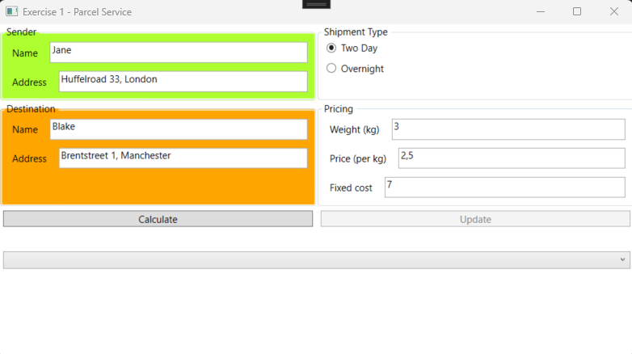
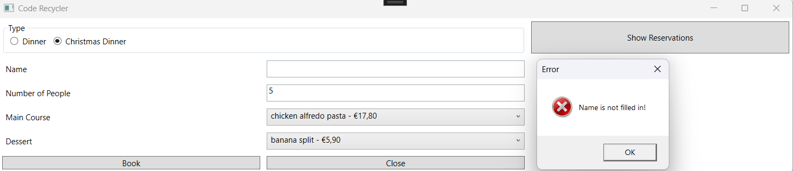

# Exam Examples

## Setup
- Create a project. The solution name must be:`ExamExamples`, the project name: `ExamExamples_WPF`.
- Update the MainWindow to navigate to the exercises.

### Design


## Exercise 1 – Parcel Service

### Part 1 – Classes

#### 1.1 Package
Create the following class.


- **Constructor**:
There is only one constructor, which is the constructor with all parameters. No other constructors may be added!

- **Property `PricePerKg`**:
The value cannot be less than 0. If the value is less than 0, an Exception is thrown with the message: "Price per kg cannot be negative.".

- **Property `Weight`**
The value cannot be less than 0. If the value is less than 0, an Exception is thrown with the message: "Weight cannot be negative.".

- **Method `ShippingCosts()`**
The shipping costs are calculated as: `Weight * PricePerKg`.

- **Method `CalculateShippingCosts()`**
The return value is a string and is constructed as follows: `Weight x PricePerKg = ShippingCosts`

All numeric values are rounded to 2 decimal places.

- **Method `ToString()`**
The textual representation is as follows:
```
Shipment details:
Sender: SenderName, SenderAddress
Destination: DestinationName, DestinationAddress
Weight: Weight
Total Cost: CalculateShippingCosts
```

#### 1.2 TwodayPackage
Create the following class.


- **Property `FixedCost`**
The value cannot be less than 0. If the value is less than 0, an Exception is thrown with the message: "Fixed cost cannot be negative.".

- **Method `ShippingCosts()`**
The shipping costs are calculated as: `Weight * PricePerKg + FixedCost`. Use the parent class!

- **Method `CalculateShippingCosts()`**
The return value is a string and is constructed as follows: `Weight x PricePerKg + FixedCost = ShippingCosts`

All numeric values are rounded to 2 decimal places.

#### 1.3 OvernightPackage
Create the following class.


- **Property `SurchargePerKg`**
The value cannot be less than 0. If the value is less than 0, an Exception is thrown with the message: "Surcharge per kg cannot be negative.".

- **Method `ShippingCosts()`**
The shipping costs are calculated as: `(PricePerKg + SurchargePerKg) * Weight`

All numeric values are rounded to 2 decimal places.

### Part 2 – MainWindow

#### Design


### Procedure:
- When the "Two Day" radio button is selected, the label `lbShipmentType` is updated to "Fixed Cost".


  
- When the "Overnight" radio button is selected, the label `lbShipmentType` is updated to "Surcharge Per Kg".


- When the form loads, the `btnUpdate` button is disabled.


- When the form loads, the file `parcelService.txt` is read. Use a DAL (Data Access Layer) for this. A list of packages is populated. Any errors are caught and logged in an error file. Only valid records are added to the list. The list is linked to the ComboBox.


- When the "Calculate" button is clicked, the appropriate object is created based on the selected radio button. This object is added to a list. Any exceptions thrown by the object are caught, displayed in a MessageBox, and logged in an error file. Errors for non-numeric values are displayed in a MessageBox. After successful addition, the fields are cleared. The amount to be paid is displayed in the label `lblTotalCost`.




#### Examples of Possible Errors:

- Invalid numeric values.
- Negative values for `PricePerKg`, `Weight`, `FixedCost`, or `SurchargePerKg`.


- When an item is selected in the ComboBox, the `btnCalculate` button is disabled, and the `btnUpdate` button is enabled.


- The text fields and radio buttons are populated based on the selected item.

- After clicking "Update," the changes are applied to the selected item. Necessary validations are also performed here!


## Exercise 2 – Christmasdinner

### Part 1 – Classes

#### 1.1 Dish

Create the following class.


- **Constructor**:
Only one constructor is allowed, which is the constructor with all parameters.

- **`ToString()`**
The textual representation is as follows: `Name –  € Price` with the price rounded to 2 decimal places.

Example:


#### 1.2 Dinner Reservation

Create the following class.


- **Constructor**:
Only one constructor is allowed, which is the constructor with all parameters.

- **Additional Validation for Property `NumberOfPeople`**:
The number of people must be greater than 0! If this is not the case, a `CustomException` is thrown with the message: `Number of people must be a positive number!`

- **Additional Validation for Property `Name`**:
The name must not be an empty string! If this is not the case, a `CustomException` is thrown with the message: `Name is not filled in!`

- **Method `TotalCost()`**:
This method calculates the total cost of the reservation as follows: `NumberOfPeople * MainCoursePrice`

- **Method `Equals(object)`**:
Two objects are the same if their names are the same, regardless of the type.

- **`ToString()`**:
The textual representation is as follows: `Type Name € TotalCost` with the total rounded to 2 decimal places. The type corresponds to the class name WITHOUT the word "Reservatie" (Reservation).

Example for `DinnerReservation`:


Example for `ChristmassDinnerReservation`:


#### 1.3 ChristmasDinnerReservation

Create the following class.


- **Constructor**:
Only one constructor is allowed, which is the constructor with all parameters.

- **Method `TotalCost()`**:
This method overrides the `TotalCost` method of the superclass and calculates the total cost of the reservation as follows: `NumberOfPeople * MainCoursePrice + numberOfPeople * DessertPrice`

Use the `TotalCost` method of the parent class!

### Part 2 – MainWindow

#### Procedure:
- Replace the title of the window "MainWindow" with your name.


- When the form loads, the "Dinner" radio button is selected. If the "Dinner" radio button is selected, the label `lblDessert` and the ComboBox `cmbNagerechten` (Desserts ComboBox) are not visible.


- If the "Christmas Dinner" radio button is selected, the label `lblDessert` and the ComboBox `cmbDesserts` become visible.


- When the form loads, the file `dishes.txt` is read. This file is structured as follows:
```
Name;price;type
Name;price;type
Name;price;type
...
```

Each row is used to create a `Dish` object. This object is added to a list of `Dish` objects. Use a separate DAL (Data Access Layer) project for reading the data.


Based on the full list, two other lists are populated: one with only main courses and one with only desserts. The splitting into two separate lists is done in the `MainWindow`.


The ComboBox `cmbMainCourses` is linked to the list of main courses.


The ComboBox `cmbDesserts` is linked to the list of desserts.

- When the "Close" button is clicked, the form is closed.

- When the "Book" button is clicked:

**STEP 1:** Perform the necessary validation.
The following validation is done in the form:
- Is the number of people a numeric value?
- Is something selected in the main courses ComboBox?
- Is something selected in the desserts ComboBox for a Christmas dinner?
If an error occurs, a MessageBox is displayed with one of the following messages:

Possible error messages for "Dinner": 

  

Possible error messages for "Christmass Dinner":

      

**STEP 2:** If there are no validation errors (Step 1), the appropriate object (`DinnerReservation` or `ChristmasDinnerReservation`) is created based on the selected radio button. Catch any errors thrown by the object. Display any errors in a MessageBox and log them in a file! Write the `LogErrors` method in the separate DAL layer.




The `LogErrors` method must log the following data:
- Timestamp (HH:mm:ss)
- Error type
- Message
- Stack trace

**STEP 3:** If no object errors occur, the object is added to a list. This list must not contain duplicates. If a duplicate is found, display the error message: `You have already booked! Changes are not allowed!`


**STEP 4:** If the list contains 5 objects, the `btnBook` button is disabled, and the message: `No more reservations are accepted. The restaurant is full!` is displayed.


- When the "Show Reservations" button is clicked, all reservations are displayed in the label `lblReservations`.


