# Repetition Exercise Pokemon

## Setup
- Create a project. The solution name must be:`RepetitionExercisePokemon`, the project name: `RepetitionExercisePokemon_WPF`.
- Update the MainWindow to navigate to the exercises.

### Design

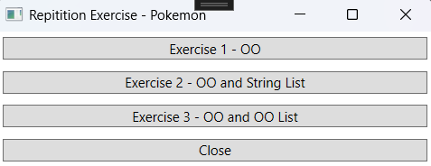

## Exercise 1 – Pokemon Part 1

### Objective
- Work with Classes.

### Class Design

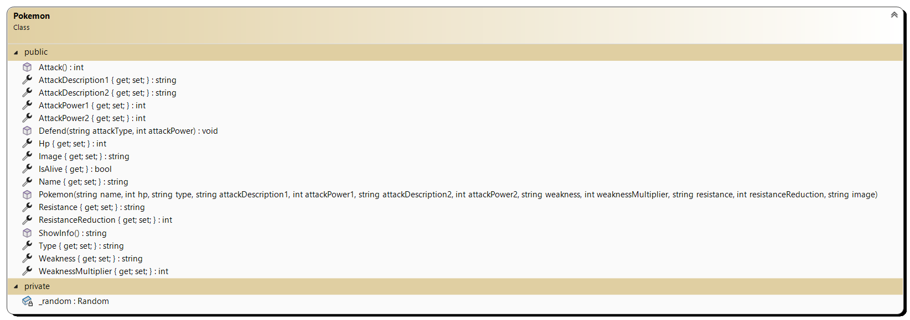

#### Additional Information:
- Property `Hp`: The `Hp` value cannot be less than 0. If a negative value is entered, it is set to 0.
- Property `IsAlive`: Returns "alive" if the `Hp` value is greater than 0; otherwise, it returns "dead".
- Method `Attack()`: Normally returns `_attackPower1`. However, there is a 1 in 2 chance that `_attackPower2` is used, and a 1 in 5 chance that the attack factor is multiplied by 2.
- Method `Defend(string aanvalstype, int attack)` (Defend):
  - If the attacker's attack type matches the Pokémon's weakness, the `Hp` is reduced by the attacker's `attack` value multiplied by the weakness factor.
  - If the attacker's attack type matches the Pokémon's resistance, the `attack` value is first reduced by the resistance factor before being subtracted from the `Hp`.
  - In all other cases, the `Hp` is reduced by the `attack` value.
- `ShowInfo`: Returns a textual representation of the object:
  - For a living Pokémon:
    ```
    'Name' is still alive.
    Remaining HP: 'HP'
    ```
  - For a dead Pokémon:
    ```
    'Name' is dead.
    Remaining HP: 'HP'
    ```

### Design

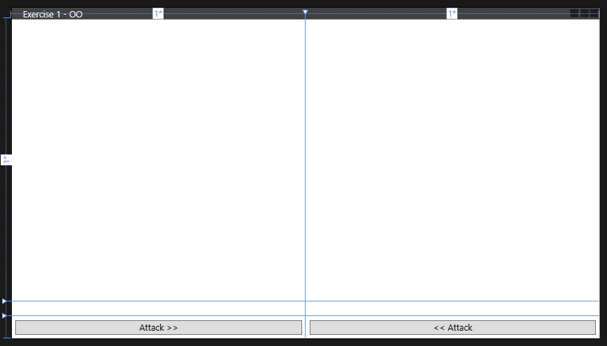

#### Setting the Image Tag:
```xml
<Image x:Name="imgPokemonPlayer1" Stretch="Fill" Grid.Row="0" Grid.Column="0" Margin="5"/>
<Image x:Name="imgPokemonPlayer2" Stretch="Fill" Grid.Row="0" Grid.Column="1" Margin="5"/>
```

### Procedure

- Copy the following method into the code:
```csharp
private void StelImageIn() {
    imgPokemonPlayer1.Source = new BitmapImage(new Uri(@"img\Exercise 1\Raichu.png`", UriKind.Relative));
    imgPokemonPlayer2.Source = new BitmapImage(new Uri(@"img\Exercise 1\eevee.png", UriKind.Relative));
}
```

- When the form loads, two Pokémon are created:

| Pokemon 1                          | Pokemon 2                      |
| ---------------------------------- | ------------------------------ |
| Name: Raichu                       | Name: Eevee                    |
| Type: Electric                     | Type: Colorless                |
| HP: 90                             | HP: 50                         |
| AttackDescription1: Thunder Struck | AttackDescription1: Smash Kick |
| AttackPower1: 30                   | AttackPower1: 10               |
| AttackDescription2: Electro ball   | AttackDescription2: Tail Whap  |
| AttackPower2: 30                   | AttackPower2: 20               |
| Weakness: Fighting                 | Weakness: Fighting             |
| WeaknessMultiplier: 2              | WeaknessMultiplier: 2          |
| Resistance:Metal                   | Resistance:None                |
| ResistanceReduction: 20            | ResistanceReduction: 0         |
| Image: Raichu.png                  | Image: eevee.png               |

- Ensure the images are displayed by calling the `SetImage` method. Display the Pokémon's details in the labels.

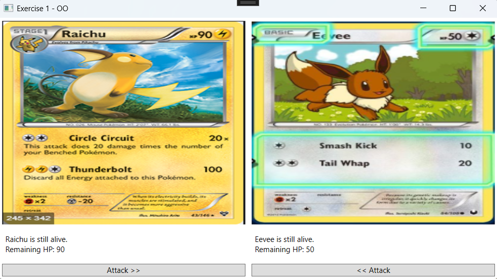

- When the "Attack >>" button is clicked, Pokémon 1 attacks Pokémon 2, and the details are updated in the label.

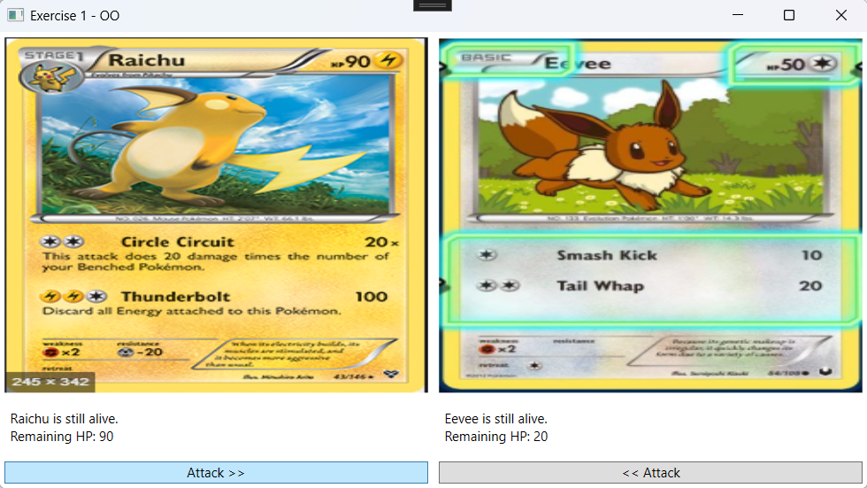

- When the "<< Attack" button is clicked, Pokémon 2 attacks Pokémon 1, and the details are updated in the label.

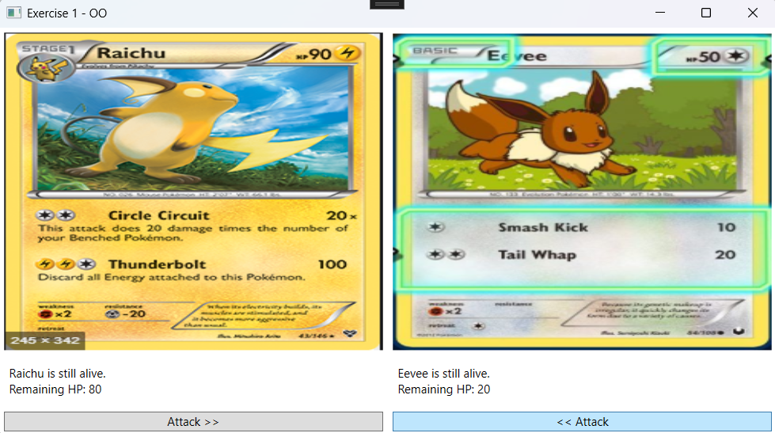

- This continues until one Pokémon is dead.

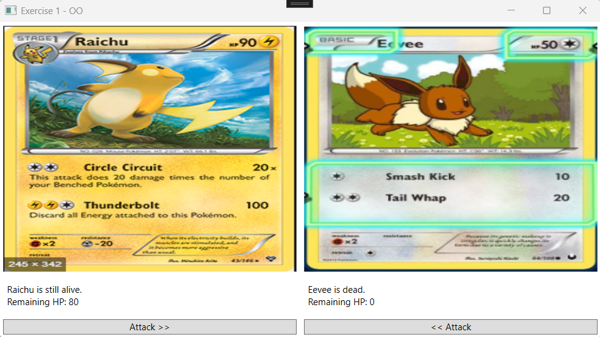

---

## Exercise 2 – Pokemon Part 2

### Objective
- Work with Classes.
- Work with Lists.

### Design

Extend the previous form with two ComboBoxes.

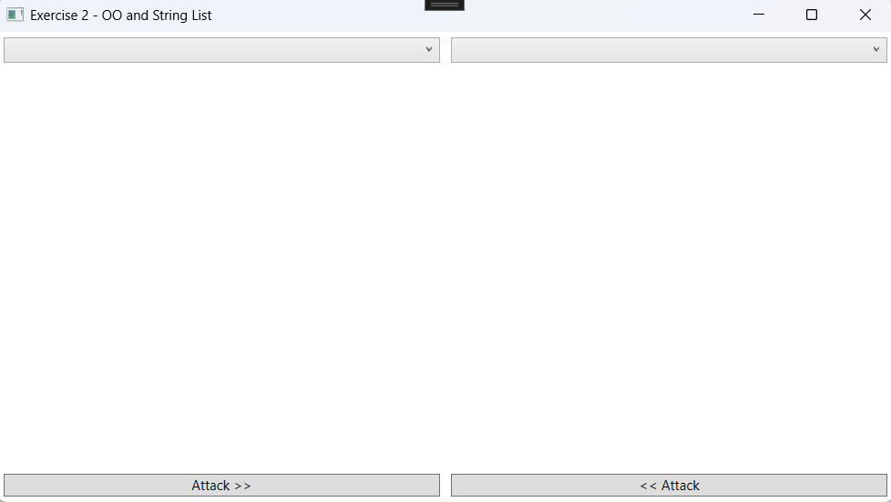

### Procedure

- When the form loads, two lists are populated with names from the files pokemoncards1.txt and pokemoncards2.txt. Use a separate DAL project for reading the data. (List<string>)

Example of pokemoncards1.txt (for player 1):
```
Alolan Raticate
Altaria
Charizard
```

Example of pokemoncards2.txt (for player 2):
```
Dragonite
Eevee
Glaceon
```

Link the ComboBoxes to the lists.

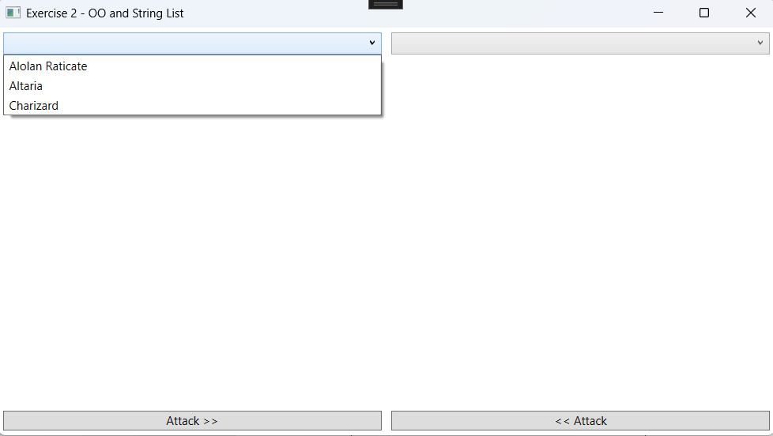

| Alolan Raticate                 | Altaria                          | Charizard                         |
|---------------------------------|----------------------------------|-----------------------------------|
| Name: Alolan Raticate           | Name: Altaria                    | Name: Charizard                   |
| Type: Dark                      | Type: Colorless                  | Type: Fire                        |
| HP: 120                         | HP: 90                           | HP: 250                           |
| AttackDescription1: Evil Orders | AttackDescription1: Draco Melody | AttackDescription1: Flamethrower  |
| AttackPower1: 10                | AttackPower1: 10                 | AttackPower1: 140                 |
| AttackDescription2: Endeavor    | AttackDescription2: Cotton Guard | AttackDescription2: Flare Blitz   |
| AttackPower2: 60                | AttackPower2: 30                 | AttackPower2: 300                 |
| Weakness: Fighting              | Weakness: Electric               | Weakness: Water                   |
| WeaknessMultiplier: 2           | WeaknessMultiplier: 2            | WeaknessMultiplier: 2             |
| Resistance: Psychic             | Resistance: Fighting             | Resistance: None                  |
| ResistanceReduction: 20         | ResistanceReduction: 20          | ResistanceReduction: 0            |
| Image: alolan_raticate.png      | Image: altaria.png               | Image: Charizard.jpg              |


| Dragonite                      | Eevee                             | Glaceon                          |
|--------------------------------|-----------------------------------|----------------------------------|
| Name: Dragonite                | Name: Eevee                       | Name: Glaceon                    |
| Type: Dragon                   | Type: Colorless                   | Type: Water                      |
| HP: 180                        | HP: 60                            | HP: 200                          |
| AttackDescription1: Bust In    | AttackDescription1: Growl         | AttackDescription1: Frost Bullet |
| AttackPower1: 10               | AttackPower1: 10                  | AttackPower1: 90                 |
| AttackDescription2: Jet Sonic  | AttackDescription2: Quick Attack  | AttackDescription2: Ploas Spear  |
| AttackPower2: 80               | AttackPower2: 10                  | AttackPower2: 50                 |
| Weakness: Fairy                | Weakness: Fighting                | Weakness: Metal                  |
| WeaknessMultiplier: 2          | WeaknessMultiplier: 2             | WeaknessMultiplier: 2            |
| Resistance: None               | Resistance: None                  | Resistance: None                 |
| ResistanceReduction: 0         | ResistanceReduction: 0            | ResistanceReduction: 0           |
| Image: Dragonite.png           | Image: Eevee.jpg                  | Image: glaceon.png               |

The image and details are displayed. The ComboBox is disabled after selection (`IsEnabled = false`).

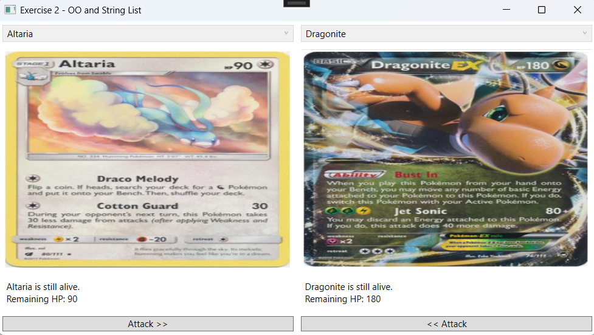

- When the "Attack >>" button is clicked, Pokémon 1 attacks Pokémon 2, and the details are updated in the label.

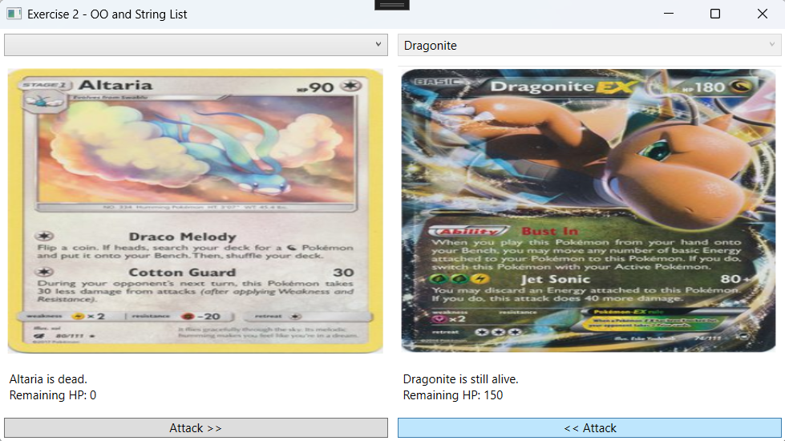

- When a Pokémon dies, its name is removed from the ComboBox, and the ComboBox is re-enabled. The player can choose a new card.

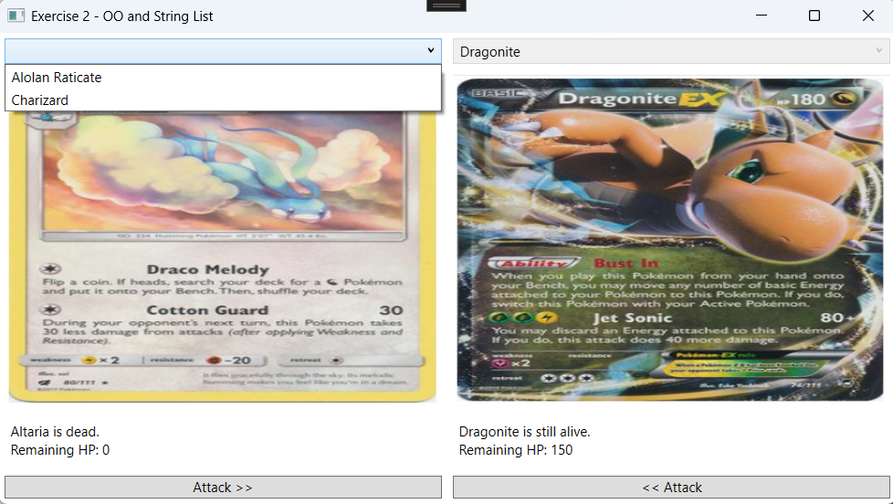

- Once a player has no more names available, the player loses. A MessageBox is displayed.

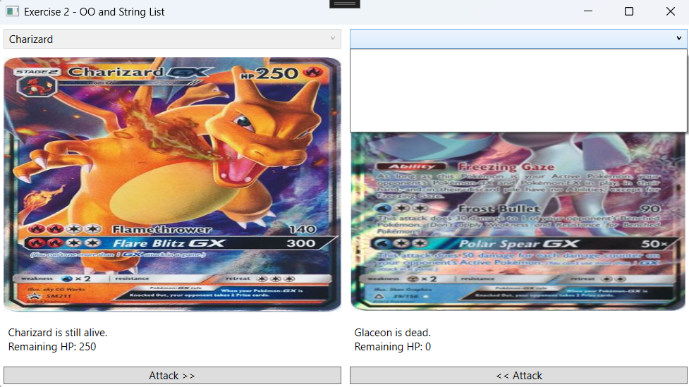 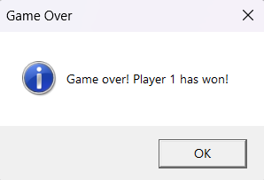

---

## Exercise 3 – Pokemon Part 3

### Objective
- Work with Classes.
- Work with Lists of Objects.

### Procedure
- When the form loads, two lists are populated with data from the files pokemoncards1.txt and pokemoncards2.txt. Each line in the file represents one Pokémon. (List<Pokemon>). Use a separate DAL project for retrieving the data.

- The ComboBox is now linked to a list of Pokemon objects. Ensure the Pokémon's name is displayed.

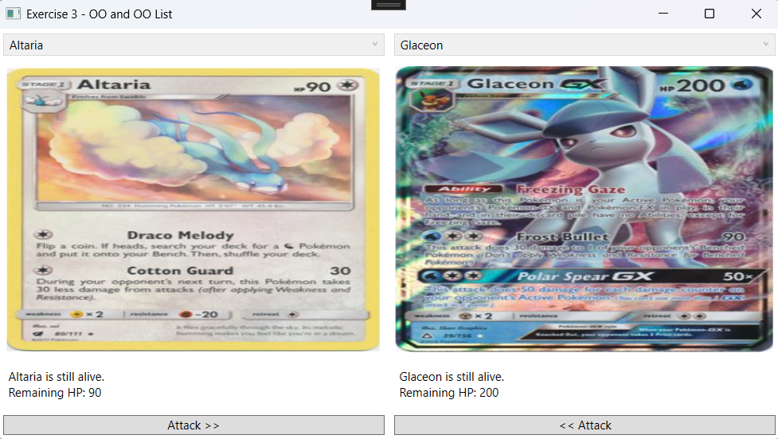

- When the "Attack >>" button is clicked, Pokémon 1 attacks Pokémon 2, and the details are updated in the label.

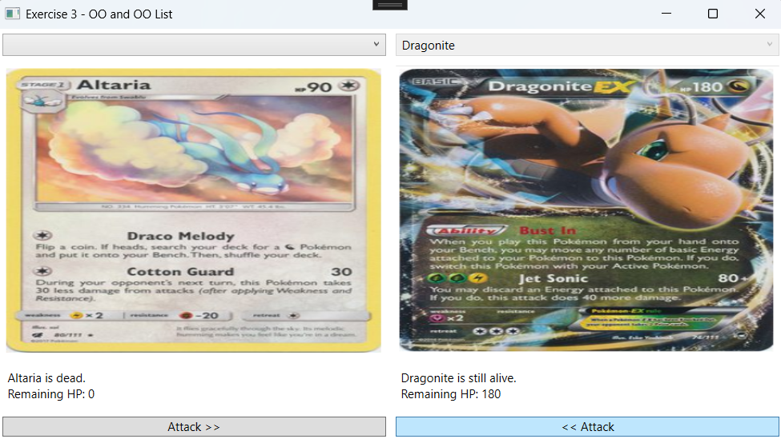

- When a Pokémon dies, the Pokemon object is removed from the ComboBox, and the ComboBox is re-enabled. The player can choose a new card.

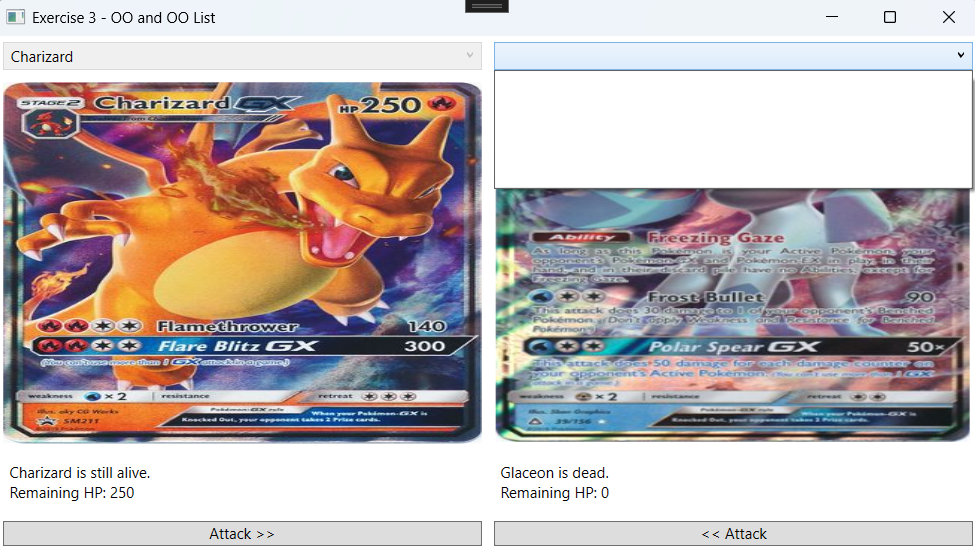 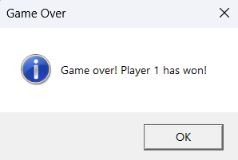